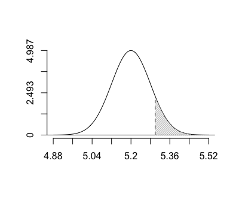

# Eldar - Elvish utilities for R
A collection of miscellaneous utilities for R programming. Evolving, but currently limited to plotting Normal Distributions.

## Quick Normal Distributions
**my.normal**

Quickly plot a Normal distribution and highlight a specific area.

Contrived Example: The weight of a certain packaged product has a mean of 5.2 kg and a standard deviation of 0.08 kg and follows a Normal distribution. If we drew a single package, what is the probability that the mean weight is over 5.3 kg?

To quickly illustrate our variable of interest, we can quickly show this with one line:

    > my.normal(mean = 5.2, sd = 0.08, x1 = 5.3)

You can also add your own vertical lines with `mn.vline.at` and additional shaded regions with `mn.shade`. See the man pages in R for more info.
